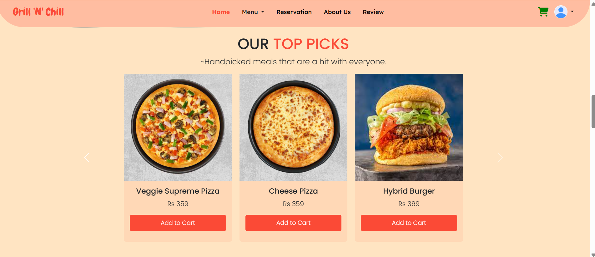
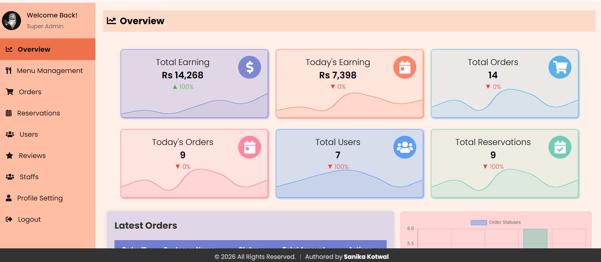

# 🍽️ Restaurant Management & Food Ordering System

A full-stack, role-based web application designed to streamline restaurant operations and enhance the customer dining experience.
Built with **PHP, MySQL, and JavaScript**, this system integrates user ordering, admin management, and analytics into a single platform.

## Key Highlights

* Role-based system with separate **Admin** and **User** interfaces
* Full-stack web application with database integration
* Admin dashboard with analytics and operational controls
* Real-time order handling and tracking
* Responsive design for desktop, tablet, and mobile devices
* Simulates real-world restaurant workflow and management

## About

This project provides a complete digital solution for restaurants by combining:

* A seamless interface for customers to browse, order, and interact
* A powerful admin panel for managing orders, staff, and content
* Analytical insights to monitor performance and activity

The system is designed with scalability and usability in mind, making it suitable for real-world deployment scenarios.

## Features

### User Side

* User Registration & Secure Login
* Browse categorized menu with images and details
* Add to Cart & manage quantities
* Place Orders with tracking
* Order History & Review system
* Table Reservation functionality
* Profile Management

### Admin Side

* Dashboard overview (earnings, orders, users, reservations)
* Menu Management (Add / Update / Delete items)
* Order Management (status updates & tracking)
* Reservation Management
* User & Review Management
* Staff Management system
* Profile & system configuration

## Technology Stack

* **Frontend:** HTML, CSS, JavaScript
* **Backend:** PHP
* **Database:** MySQL
* **Libraries & Tools:** Bootstrap, jQuery, AOS

## Screenshots

### User Interface



### Admin Dashboard



## ⚙️ Setup & Installation

1. Clone the repository:

```
git clone https://github.com/your-username/Restaurant-Management-Food-Ordering-System.git
```

2. Move the project to:

```
C:\xampp\htdocs\
```

3. Import the database:

* Open **phpMyAdmin**
* Import `restaurant.sql`

4. Configure database connection:

* Update credentials in `db_connection.php`

## Run the Application

Start **XAMPP (Apache + MySQL)** and open:

```
http://localhost/Resturaunt
```

## Demo Credentials

### Admin Access

* Email: [admin@gmail.com]
* Password: admin2024

### User Access

* Register a new account to explore user features

## License

This project is licensed under the MIT License.

## Author

**Sanika Kotwal**

